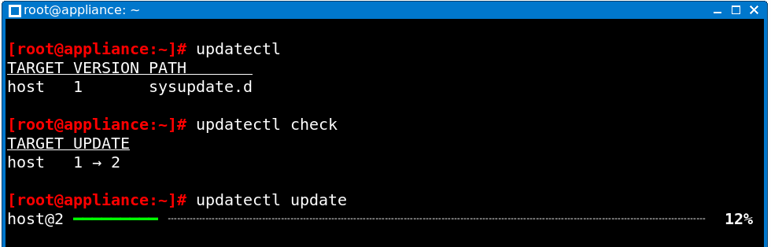

# NixOS Appliance Images with A/B Over-the-Air (OTA) Update Scheme

This repository is a demonstrator for:

- Creating bootable NixOS images with [systemd-repart](https://www.freedesktop.org/software/systemd/man/systemd-repart.html)
- Updating NixOS using A/B system partitions [over the air](https://en.wikipedia.org/wiki/Over-the-air_update) with [systemd-sysupdate](https://www.freedesktop.org/software/systemd/man/systemd-sysupdate.html)
- Building and hosting systemd-sysupdate ready update images
- Minimizing a NixOS system (With minimal desktop to ~350MB)
- Cross-Compiling NixOS from x86_64 to aarch64 and the other way around

This is not included in the demo but can be added from here:

- Integrity-checked system updates using [GPG signatures](https://www.freedesktop.org/software/systemd/man/latest/sysupdate.d.html#Verify=)
- Adding verity partitions for [Linux transparent integrity checking of block devices](https://www.kernel.org/doc/html/next/admin-guide/device-mapper/verity.html)
- Setting up automatic [boot assessment](https://systemd.io/AUTOMATIC_BOOT_ASSESSMENT/) for automatic reverts if the system consistently fails to boot
- Automatic [encryption with TPM/FIDO2 at first boot](https://www.freedesktop.org/software/systemd/man/latest/repart.d.html#Encrypt=)

## Run the demo

Demo video on youtube:
[](https://www.youtube.com/watch?v=vH_hBej5-m4)

You can run the demo VM which can update itself like this:

```console
nix run
```

In the VM, you can run the following commands:

```console
# List partitions to monitor changes on A/B system partitions
parted -l

# List system version
updatectl list

# Check for updates
updatectl check

# Install latest update
updatectl update

# Remove old system version (nice to see but unnecessary in normal update flows)
systemd-sysupdate vacuum -m 1
```

### Screenshots

The partition table after the first boot.
System partition B is still left empty:


Listing system version, possible update, and updating:



Partition table after update.
The system partition B now contains system version 2:


During reboot, both system versions are installed:


After booting system version 2 from partition B, partition A can be removed.
Although this is not necessary as successive updates can reuse the old partition anyway:


## Run the demo for other architectures

These demos will run on x86_64 and aarch64 host systems:

```console
nix run .#vm-demo-aarch64
nix run .#vm-demo-x86_64
```

Please note that emulating the other platform is slower than running the demo on the same platform.

## Just build the images

### Full system image

Build the image as it could be copied to a disk using `dd`:

```console
# for the same platform
nix build .#image-v1

# for other platforms
nix build .#image-v1-aarch64
nix build .#image-v1-x86_64
```

### Update image

Build the parts of the image that can be served via HTTP for updates:

```console
# for the same platform
nix build .#update-v2

# for other platforms
nix build .#update-v2-aarch64
nix build .#update-v2-x86_64
```

## Understanding the code

### Describing NixOS appliance images and updates

For this part, ignore `flake.nix`, it is mostly relevant for cross compilation.

Currently there is not much documentation about this, but if you want to understand how to build a system like this yourself, concentrate on these files:

#### [`system-configuration/configuration.nix`](./system-configuration/configuration.nix)

Top-level system configuration.
The idea here is that the settings in the top-level configuration file are very much
application specific, while other important modules are platform specific.

#### [`system-configuration/image.nix`](./system-configuration/image.nix)

Definition of the systemd-repart image creation process which is also the base for the NixOS configuration that describes how to mount the disk at runtime.

#### [`system-configuration/update.nix`](./system-configuration/update.nix)

systemd-sysupdate configuration for automatic updates.
The transfer descriptions in this file are very dependent on the partitioning scheme in `image.nix`.

#### [`system-configuration/desktop.nix`](./system-configuration/desktop.nix)

Minimal desktop setup with auto login and automatic X start.

#### [`system-configuration/size-reduction.nix`](./system-configuration/size-reduction.nix)

General size reduction for NixOS appliance images without Nix, Perl, etc.
(Might be too minimal for production systems.)

#### [`system-configuration/update-package.nix`](./system-configuration/update-package.nix)

This image does not describe the system itself but creates a build target for the update images that only contain the required parts of the system update.

### Cross compilation and demo scripts

These are described in [`flake.nix`](./flake.nix).
The majority of its complexity stems from setting up the NixOS configuration for cross compilation and later running the images in Qemu.

In general, NixOS systems can be set up for cross compilation inside the NixOS configuration.

This example snippet would be part of a bigger NixOS configuration that runs on ARM CPUs and builds on Intel/AMD CPUs:

```nix
{
  nixpkgs = {
    buildPlatform = "x86_64-linux";
    hostPlatform = "aarch64-linux";
  };
}
```

Other platforms like e.g. `riscv64-linux` are possible, too.
Please note that not all but many packages from nixpkgs cross-compile.

## Consulting

Would you like help, a potential analysis for your products, or training for your team?
Contact us, we do this every day for many organizations worldwide: hello@nixcademy.com
